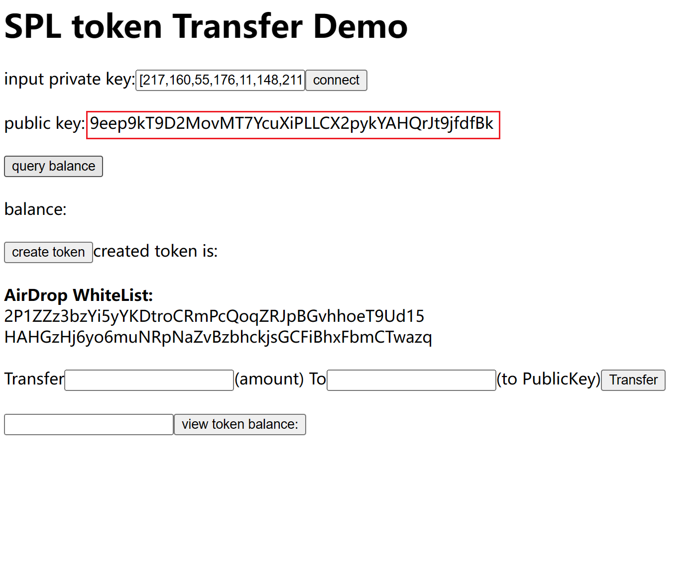
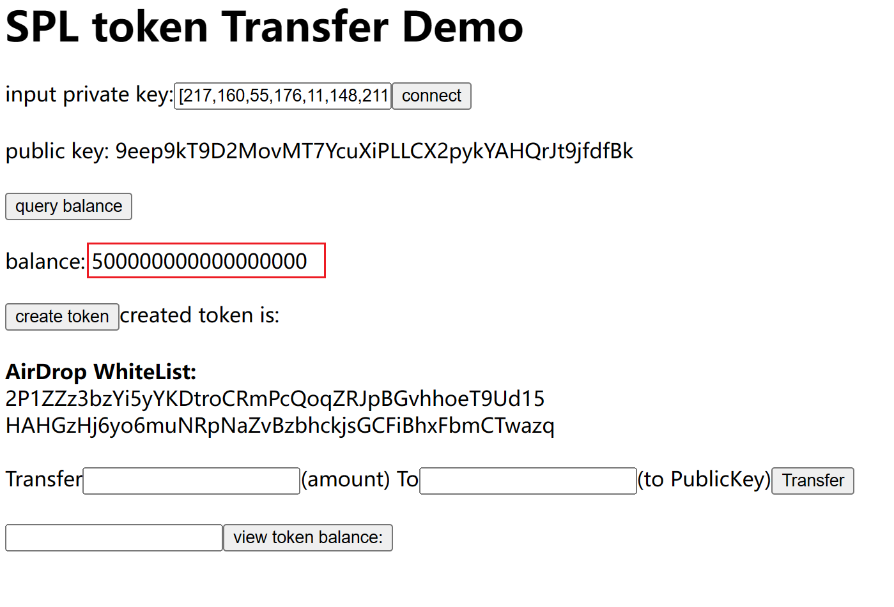
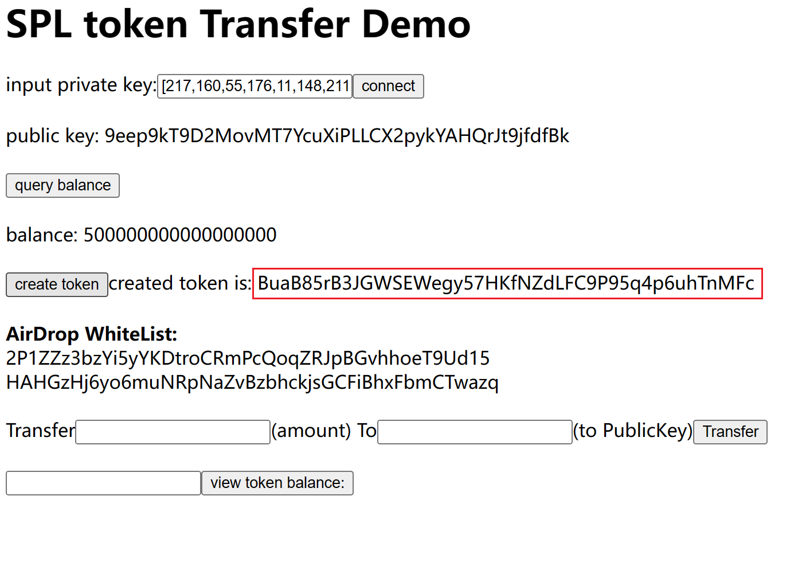
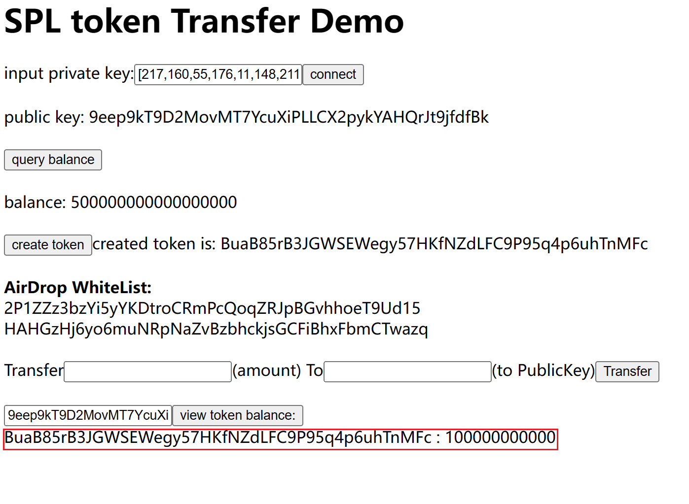
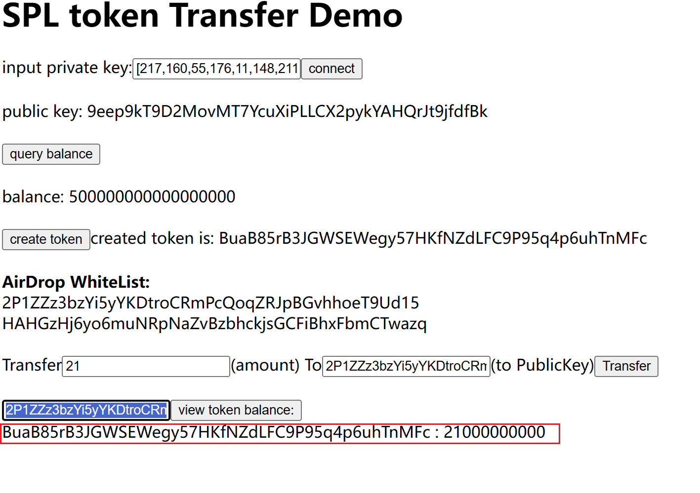
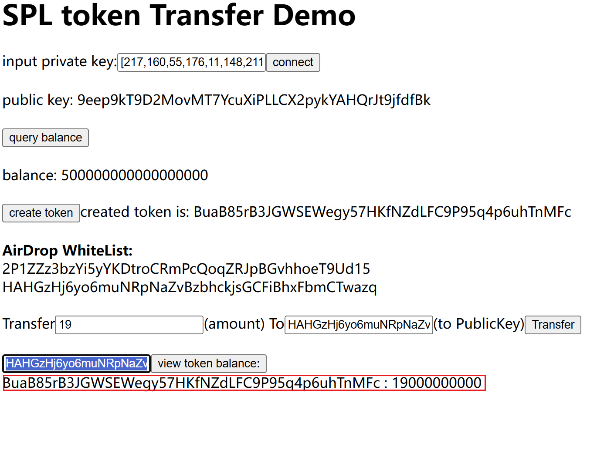

# 导入私钥,显示公钥

# 查询余额(sol)

# 创建token,显示其地址

# 创建时默认mint了100个给当前账号,查询确认其token数量

# 向白名单中的第一个账号发送21个token,再查询确认其token数量

hash: 5jgqvYfCJTCttdYWaYJg4rw9FiaqMeEU14P7WHQoM6inJMgaA5iFvLz4fRyMJ6YkS5W3FX3fTAQ1Ks19ubqC2Bht

# 向白名单中的第二个账号发送19个token,再查询确认其token数量

hash: 5DRQrf2d74myv6xtr1Jaq75gpxEf2xCPE5KiNzZdEZoAbLzhBaX3BX15ebz2rvRn4zjSQK3h6Rhsy9xFeg6buM3c
